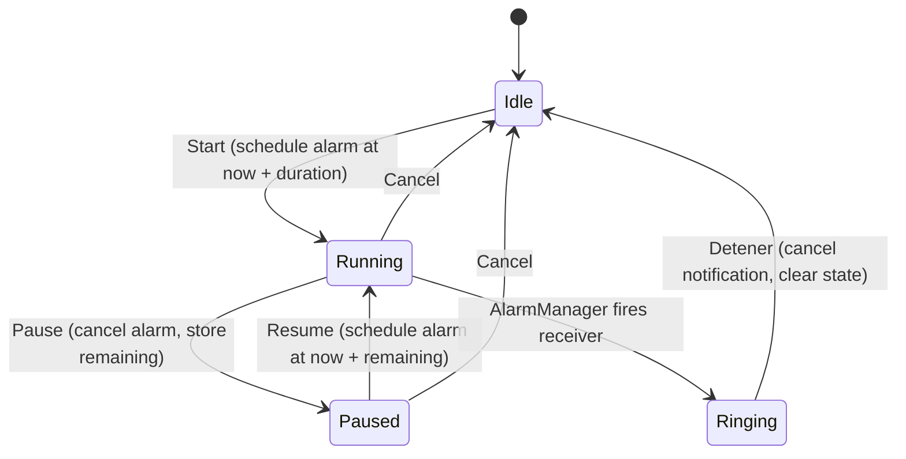

# Architecture

Little Chef Timer is a single-module Android app (Kotlin + Jetpack Compose, minSdk 26).

## Components

| File | Role |
|------|------|
| `MainActivity.kt` | Compose UI: recipe list, create/edit dialog, timer screen, options menu (alarm sound, backup export/import). |
| `Recipe.kt` | `Recipe` and `TimerState` models, JSON (de)serialization, and `RecipeStore` (SharedPreferences). |
| `TimerAlarm.kt` | Schedules/cancels the alarm with `AlarmManager` and posts the ringing notification from `TimerAlarmReceiver`. |

## Timer flow

- The timer state is persisted (`endAtMillis` while running, `remainingMillis` while paused), so the UI recomputes the countdown on every tick and survives the app being killed.
- `AlarmManager.setAlarmClock` fires exactly, even in Doze mode. On Android 13+ (API 33+) it uses `USE_EXACT_ALARM` (granted at install time for timer apps), on Android 12 (API 31-32) it uses `SCHEDULE_EXACT_ALARM`, and falls back to `setAndAllowWhileIdle` if exact alarms are dynamically disabled by system policy.
- The ringing is a high-importance notification with `FLAG_INSISTENT`: its channel sound loops until the user taps **Detener** / **Stop** or dismisses it. When the notification clears or updates the timer from outside the UI, `RecipeStore` notifies listeners reactively via `SharedPreferences.OnSharedPreferenceChangeListener` (hooked into a Compose `DisposableEffect`), avoiding polling disk reads.

## Alarm sound

The system ringtone picker (`RingtoneManager.ACTION_RINGTONE_PICKER`, alarm type) returns a URI that is stored in preferences. A notification channel's sound is fixed once created, so each sound gets its own channel id (`alarm_<hash>`) and older channels are deleted.

## Theme and language

- Material 3 with a lilac/pink palette taken from the icon, in light and dark variants. The theme is Follow system (default), Light or Dark. It is stored in preferences and applied live. `values-night/themes.xml` gives the window a dark background so a dark launch doesn't flash white.
- UI strings live in `values/strings.xml` (English) and `values-es/strings.xml` (Spanish). The language is Phone language (default), English or Español. `withAppLanguage()` wraps the activity context in `attachBaseContext`, and the notification context too. Changing the language recreates the activity.
- The example recipes are written in whatever language is active on first launch. After that they are user data and don't get translated.

## Backup

Export and import use the Storage Access Framework (`CreateDocument` / `OpenDocument`), so no storage permission is needed. The file has the same JSON format as the stored list (see [data-model.md](data-model.md)). Import validates the whole file first and only replaces the list after confirmation.

## Why no Room and no foreground service

- The data is a short list of recipes; a JSON string in SharedPreferences covers it without a schema or migrations.
- Nothing needs to run during the countdown: the alarm is owned by the system and the displayed time is derived from the stored end time.
